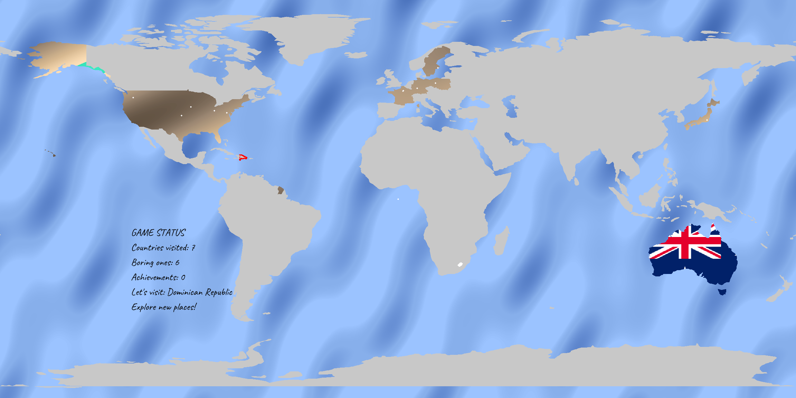

# IP Travel Wallpaper (iptw)

IP Travel Wallpaper transforms your network browsing into a gamified world exploration experience. As you visit websites and connect to servers around the globe, your digital footprints are visualized as virtual travels on a beautiful world map that becomes your desktop wallpaper.



## Game Philosophy: Breaking Out of Digital Bubbles

In our interconnected world, most internet traffic flows through a handful of major hosting platforms and CDNs located in just a few countries. This creates digital "bubbles" where we unknowingly consume content from a very limited geographic and cultural perspective.

**IPTW challenges you to:**
- **Escape the hosting monopoly**: Discover websites hosted outside major cloud platforms (AWS, Google Cloud, Azure)
- **Find authentic local voices**: Seek out small community newspapers, local blogs, and regional websites
- **Break news bubbles**: Access diverse perspectives by connecting to servers in different countries
- **Explore digital diversity**: Experience the internet as it was meant to be - truly global and decentralized

The game rewards curiosity and geographic diversity over convenience, encouraging you to venture beyond the mainstream digital highways.


## How It Works: Travel Mechanics

- **Virtual Travel**: Each network connection to a foreign IP address represents a "visit" to that country
- **Progressive Country Coloring**: Countries change appearance based on your visit frequency:
  - **1-9 visits**: Display national flag background (fresh destinations worth exploring)
  - **10+ visits**: Countries become "boring" and display sand/rocks gradient patterns (time to find new places!)
  - **Continued Activity on Boring Countries**: When boring countries receive additional hits, their patterns show slight variations to indicate ongoing activity
- **Exploration Incentives**: 
  - **Target Countries**: Red borders highlight unvisited countries, encouraging global exploration
  - **Achievement System**: Unlock achievements by visiting all countries in geographic regions
  - **Fastest Traveler Achievements**: Special rewards for marking target countries as boring quickly
  - **Discovery Rewards**: Special recognition for finding rare hosting locations
- **Real-time Visualization**: Watch your virtual travel map expand as you browse, with live connection points
- **Wallpaper Generation**: Your journey becomes a personalized, ever-changing desktop background

## Game Goals & Challenges

### 🎯 **Primary Objectives**
1. **Visit All Countries**: Can you find internet content hosted in every nation?
2. **Regional Completion**: Complete entire continents by discovering local hosting
3. **Rare Country Hunter**: Find websites in countries with minimal global hosting presence
4. **Local News Explorer**: Discover authentic local newspapers and community sites
5. **Escape the Big Three**: Minimize connections to US, EU, and Chinese mega-platforms

### 🌍 **Discovery Challenges**
- **Small Nation Challenge**: Find active websites hosted in microstates and island nations
- **Language Diversity**: Connect to servers hosting content in minority languages
- **Community Voices**: Discover local radio stations, newspapers, and blogs
- **Academic Networks**: Find university and research institution servers worldwide
- **Government Transparency**: Access official government websites hosted locally
- **Cultural Preservation**: Find sites dedicated to local traditions and heritage

### 📰 **Breaking News Bubbles**
The modern internet is dominated by a few major hosting providers, creating invisible geographic barriers to information diversity. IPTW helps you discover:
- **Hyperlocal News**: Small-town newspapers and community bulletins
- **Alternative Perspectives**: Non-Western viewpoints on global events
- **Underrepresented Voices**: Media from developing nations and marginalized communities
- **Direct Sources**: Government, academic, and institutional websites hosted locally
- **Cultural Content**: Local entertainment, art, and cultural preservation sites

## Installation & Usage

### Download Pre-built Binaries

**Latest Release**: Download platform-specific binaries from the [GitHub Releases page](https://github.com/techt3/iptw/releases)

**Platform Support:**
- **macOS**: `iptw-vX.X.X-darwin-amd64.tar.gz` (Intel) / `iptw-vX.X.X-darwin-arm64.tar.gz` (Apple Silicon) 
  - *Binaries are code-signed to prevent macOS Gatekeeper warnings*
- **Linux**: `iptw-vX.X.X-linux-amd64.tar.gz` (x86_64) / `iptw-vX.X.X-linux-arm64.tar.gz` (ARM64)
- **Windows**: `iptw-vX.X.X-windows-amd64.zip` (x86_64) / `iptw-vX.X.X-windows-arm64.zip` (ARM64)

### macOS Security Notes
- **No Gatekeeper Warnings**: All macOS binaries are code-signed to prevent "unidentified developer" warnings
- **First Run**: Simply double-click or run from terminal - no additional security steps required
- **Privacy**: If you see a network access prompt, allow it for geo-location tracking to work

### Cross-Platform Support
IPTW runs natively on **macOS**, **Linux**, and **Windows** with automatic platform detection for network monitoring.


### Self-Contained Application
- **No Setup Required**: Single executable contains all dependencies
- **No External Downloads**: Everything is embedded in the binary
- **Portable**: Run from any location without installation
- **Privacy-First**: All data processing happens locally on your machine

### Quick Start
1. Download the binary for your platform from [Releases](https://github.com/techt3/iptw/releases)
2. Extract the archive
3. Run `iptw` from terminal/command prompt
4. Start browsing the internet to begin your virtual travels
5. Watch your desktop wallpaper update with your global journey


### Background Service (Recommended)
For continuous automatic operation, install iptw as a background service:

```bash
# Install as background service (auto-starts on boot/login)
./iptw -install-service

# Check service status
./iptw -service-status

# Control service manually  
./iptw -start-service
./iptw -stop-service

# Remove service
./iptw -uninstall-service
```

## Fastest Traveler Achievement System 🚀

### New Feature: Strategic Country Targeting
IPTW now includes a dynamic achievement system that rewards strategic gameplay when dealing with target countries:

#### How It Works
- **Target Countries**: The game automatically selects random unvisited countries as targets (highlighted with red borders)
- **Fastest Traveler Achievement**: When you mark a target country as "boring," you earn a unique achievement
- **Immediate Target Rotation**: A new target is selected instantly after earning the achievement

#### Two Ways to Earn
1. **Automatic**: Visit a target country 10 times until it becomes boring automatically
2. **Manual**: Use the web API to manually mark a target country as boring

#### API Usage
```bash
# Mark the current target country as boring
curl -X POST http://localhost:32782/countries/boring \
  -H "Content-Type: application/json" \
  -d '{"country": "United States"}'
```

#### Benefits
- **Strategic Gameplay**: Encourages focused targeting of specific countries
- **Unique Achievements**: Each country gets its own "Fastest Traveler to [Country]" achievement
- **Dynamic Content**: Achievements are created on-the-fly as you play
- **Competitive Element**: Race to mark targets before they naturally become boring

#### Testing
Use the web API to test the new feature:
```bash
# Mark the current target country as boring
curl -X POST http://localhost:32782/countries/boring \
  -H "Content-Type: application/json" \
  -d '{"country": "United States"}'
```

## Configuration

IPTW uses a configuration file to customize behavior and positioning. Configuration files are located at:
- **macOS/Linux**: `~/.config/iptw/iptwrc`
- **Windows**: `%USERPROFILE%\.config\iptw\iptwrc`

The configuration file is automatically created with default values on first run. Common parameters include:

### Display Settings
- `map_width`: Width of the world map in pixels (default: 1000)
- `auto_detect_screen`: Automatically detect screen size (default: true)
- `black`: Use dark theme for map colors (default: false)

### Game Statistics Positioning
For users with smaller screens where game statistics may be drawn outside the visible area, you can manually position the stats rectangle:

- `stats_x`: X position of the game statistics rectangle (default: -1 for auto-positioning)
- `stats_y`: Y position of the game statistics rectangle (default: -1 for auto-positioning)

**Auto-positioning behavior** (when `stats_x` and `stats_y` are set to -1):
- Statistics are positioned in the bottom-left corner with automatic margins
- Position is calculated as a percentage of screen size for responsiveness

**Manual positioning** (when `stats_x` and `stats_y` are set to specific values):
- Statistics are positioned exactly at the specified pixel coordinates
- Values are constrained to keep the rectangle within screen bounds
- Useful for smaller screens or specific layout preferences

**Example configuration for manual positioning:**
```
stats_x 50    # Position stats 50 pixels from left edge
stats_y 100   # Position stats 100 pixels from top edge
```

### Performance Settings
- `update_interval`: Seconds between wallpaper updates (default: 1)
- `target_interval`: Minutes between target country changes (default: 5)
- `log_level`: Logging verbosity: debug, info, warn, error (default: info)

**Cross-Platform Service Support:**
- **macOS**: LaunchAgent (starts on user login)
- **Linux**: systemd user service (starts on login)  
- **Windows**: Windows Service (starts on system boot)

📖 **For detailed service management, see [SERVICE.md](SERVICE.md)**

## Wallpaper Backup & Restore

IPTW automatically backs up your original desktop wallpaper before making any changes and can restore it when the application exits or on demand.

### Automatic Backup & Restore
- **Automatic Backup**: On the first wallpaper change, IPTW automatically saves your current wallpaper
- **Graceful Shutdown**: When IPTW exits (Ctrl+C or SIGTERM), it automatically restores your original wallpaper
- **Backup Location**: Wallpaper backups are stored in `~/.config/iptw/output/` with timestamps

### Manual Restore via API
If you need to restore your original wallpaper while IPTW is still running:

```bash
# Restore original wallpaper via HTTP API
curl -X POST http://localhost:32782/wallpaper/restore
```

**Response:**
```json
{
  "success": true,
  "message": "Original wallpaper restored successfully"
}
```

### Supported Platforms
- **macOS**: Full support using AppleScript
- **Linux**: GNOME, XFCE, and basic support for other desktop environments
- **Windows**: Full support using Windows API

### Troubleshooting
- If backup fails, IPTW will continue running but warn that restore functionality won't be available
- KDE Linux support is limited - backup may not work perfectly on all KDE configurations
- Backup files are automatically cleaned up on application restart

### Testing
Test the wallpaper backup functionality:
```bash
# Run the test script
./scripts/test-wallpaper-backup.sh
```

## Server-Client Mode 

IPTW now supports server-client functionality for remote monitoring and statistics sharing:

### Server Mode 
Run IPTW with a built-in HTTP statistics server:
```bash
# Start with statistics server on port 32782
./iptw -server

# Use custom port
./iptw -server -port 9090
```

### Client Mode
Connect to a remote IPTW server to view statistics:
```bash
# View stats from default server (localhost:32782)
./iptw -client

# Connect to remote server
./iptw -client -server-url http://192.168.1.100:32782

# Show achievements
./iptw -client -achievements

# Show country details
./iptw -client -countries

# Watch mode: continuously poll for updates
./iptw -client -watch -interval 30
```

### Use Cases
- **Remote Monitoring**: Monitor IPTW statistics from another machine
- **Dashboard Integration**: JSON API for custom dashboards (`/stats/json`)
- **Achievement Tracking**: Monitor progress across multiple instances
- **Team Challenges**: Share statistics for group competitions

📖 **For detailed service management, see [SERVICE.md](SERVICE.md)**

## Troubleshooting

### macOS Issues

**"Apple could not verify iptw is free of malware"**
- **Solution**: This shouldn't happen with recent releases (they're code-signed), but if it does:
  - Use the included helper script: `./scripts/macos-unquarantine.sh`
  - Or right-click the binary → "Open" → click "Open" again in the dialog
  - Or run manually: `xattr -d com.apple.quarantine /path/to/iptw`

**Permission Denied**
- Make the binary executable: `chmod +x iptw`

### Linux Issues

**Permission Denied**
- Make the binary executable: `chmod +x iptw`
- For service installation: May need `sudo` depending on your system

### Windows Issues

**Windows Defender Warning**
- Windows may show a SmartScreen warning for unsigned executables
- Click "More info" → "Run anyway" if you trust the source
- Future releases will include Windows code signing

**Execution Policy Errors**
- If using PowerShell, you may need: `Set-ExecutionPolicy -ExecutionPolicy RemoteSigned -Scope CurrentUser`

### General Issues

**Network Monitoring Not Working**
- Ensure the application has network access permissions
- Some corporate firewalls may block network monitoring
- Try running with administrator/root privileges if permitted

**Wallpaper Not Updating**
- Check file permissions in the config directory
- Verify your desktop environment is supported
- Some Linux desktop environments require specific packages

## Technical Features

### Embedded Resources (No External Dependencies)
- **GeoIP Database**: IP geolocation powered by embedded GeoLite2-City database
- **World Map Data**: High-quality country boundaries from Natural Earth project
- **Typography**: Custom fonts embedded for beautiful status displays
- **Vector Graphics**: Crisp rendering at any screen resolution
- **Theme Support**: Automatic light/dark theme detection

### Network Monitoring
- **Real-time Connection Tracking**: Monitors all outbound TCP connections
- **Smart Filtering**: Excludes local/private networks, focuses on public internet
- **Protocol Support**: TCP and UDP connection monitoring
- **Performance Optimized**: Efficient native system calls on each platform

### Privacy & Security
- **Local Processing Only**: No data sent to external servers
- **No Account Required**: Completely anonymous usage
- **No Tracking**: Your browsing patterns stay on your device
- **Open Source**: Full transparency in data handling


## Licenses & Attribution

IPTW incorporates several high-quality open resources. We gratefully acknowledge:

### Geographic Data
- **World Map**: `internal/resources/naturalearth.json`
  - **Source**: [Natural Earth](https://www.naturalearthdata.com/)
  - **License**: Public Domain
  - **Description**: High-quality country boundary data at 1:50m scale
  - **Attribution**: Made with Natural Earth, free vector and raster map data from naturalearthdata.com

### GeoIP Database  
- **IP Geolocation**: `internal/geoip/GeoLite2-City.mmdb.zip`
  - **Source**: [MaxMind GeoLite2](https://dev.maxmind.com/geoip/geolite2-free-geolocation-data)
  - **License**: Creative Commons Attribution-ShareAlike 4.0 International License
  - **Description**: Free IP geolocation database
  - **Attribution**: This product includes GeoLite2 data created by MaxMind, available from https://www.maxmind.com

### Typography
- **Font Family**: `internal/resources/Caveat.zip`
  - **Source**: [Google Fonts - Caveat](https://fonts.google.com/specimen/Caveat)
  - **License**: SIL Open Font License (OFL)
  - **Designer**: Pablo Impallari
  - **Description**: Casual handwriting font for friendly, approachable text display

### Additional Resources
- **GeoJSON Maps**: Country boundary processing assisted by [geojson-maps.kyd.au](https://geojson-maps.kyd.au/)

### Flags
- **Source**: [Flagpedia](https://flagpedia.net/)
- **License**: Flag images are in the public domain (exempt from copyright). They are completely free for non-commercial and even commercial use. (https://flagpedia.net/about)
- **Usage**: Flag backgrounds are displayed for boring countries (10+ visits) when available
## Contributing

We welcome contributions to help make digital exploration more accessible and diverse! Areas where help is needed:

- **Geographic Coverage**: Help identify websites hosted in underrepresented countries
- **Cultural Insights**: Share knowledge about local internet infrastructure and hosting
- **Language Support**: Internationalization and localization efforts
- **Platform Testing**: Verification across different operating systems
- **Performance Optimization**: Network monitoring efficiency improvements

### Development Setup

**Prerequisites:**
- Go 1.24 or later
- Git
- C compiler (for CGO dependencies)

**Clone and Build:**
```bash
git clone https://github.com/techt3/iptw.git
cd iptw
make build
```

**Development Commands:**
```bash
make help              # Show all available targets
make dev               # Run in development mode
make test              # Run tests
make test-coverage     # Run tests with coverage report
make fmt               # Format code
make lint              # Lint code
make build-all         # Build for all platforms
make package           # Create release packages
make release           # Full release build
```

**Cross-Platform Building:**
The project includes comprehensive cross-platform build support via Makefile and GitHub Actions:

- **Makefile**: Local cross-platform builds for all supported architectures
- **GitHub Actions**: Automated builds and releases on every tag push

**Supported Build Targets:**
- `darwin/amd64` (macOS Intel)
- `darwin/arm64` (macOS Apple Silicon)
- `linux/amd64` (Linux x86_64)
- `linux/arm64` (Linux ARM64)
- `windows/amd64` (Windows x86_64)
- `windows/arm64` (Windows ARM64)

### Build System

**GitHub Actions Workflows:**
- **`build.yml`**: Main build and release workflow
- **`pr.yml`**: Pull request validation and testing  
- **`deps.yml`**: Automated dependency updates

**Release Process:**
1. Create a new tag: `git tag v1.0.0`
2. Push the tag: `git push origin v1.0.0`
3. GitHub Actions automatically builds and creates a release with binaries for all platforms
4. Release artifacts are available on the GitHub Releases page

### Architecture

**Cross-Platform Service Management:**
- Platform-specific service implementations with Go build tags
- Unified service interface for consistent behavior across platforms
- Native system integration (LaunchAgent, systemd, Windows Service)

**Network Monitoring:**
- Platform-specific network connection tracking
- Real-time IP geolocation with embedded GeoLite2 database
- Efficient connection filtering and processing

## Legal Notice

This software is designed for educational and awareness purposes about global internet infrastructure. Users are responsible for complying with all applicable laws and website terms of service in their jurisdiction. IPTW does not modify network traffic or bypass any security measures - it simply visualizes existing connections. 
